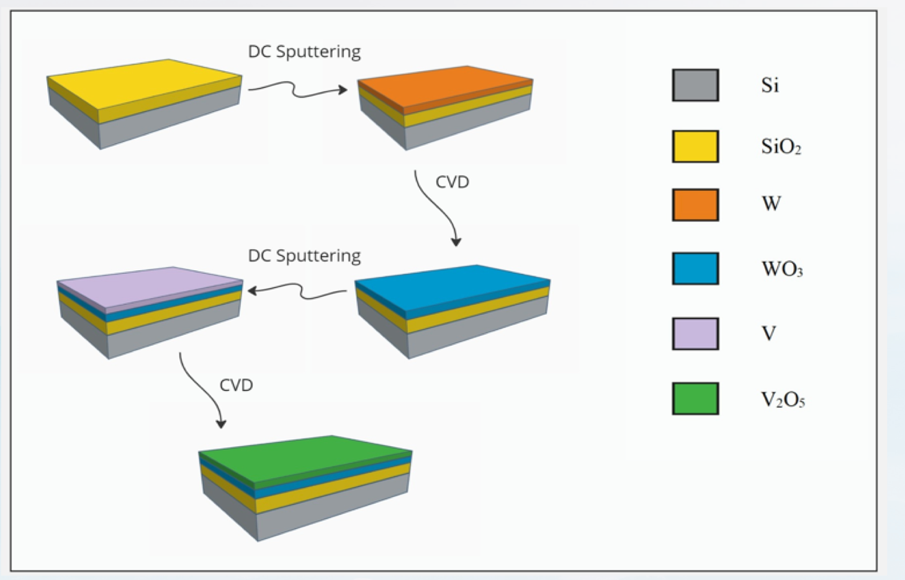
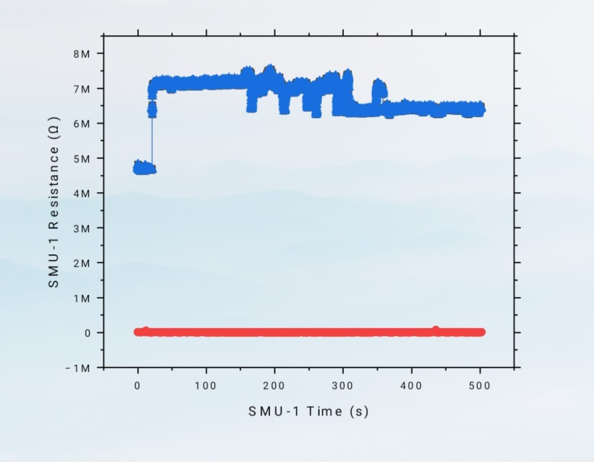
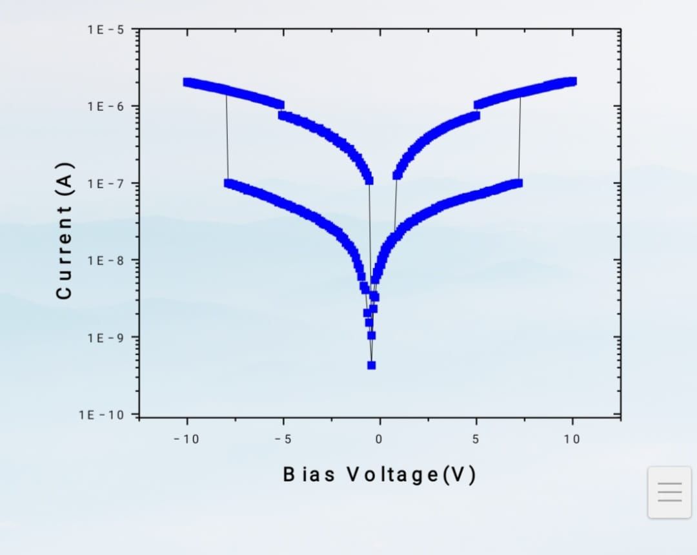
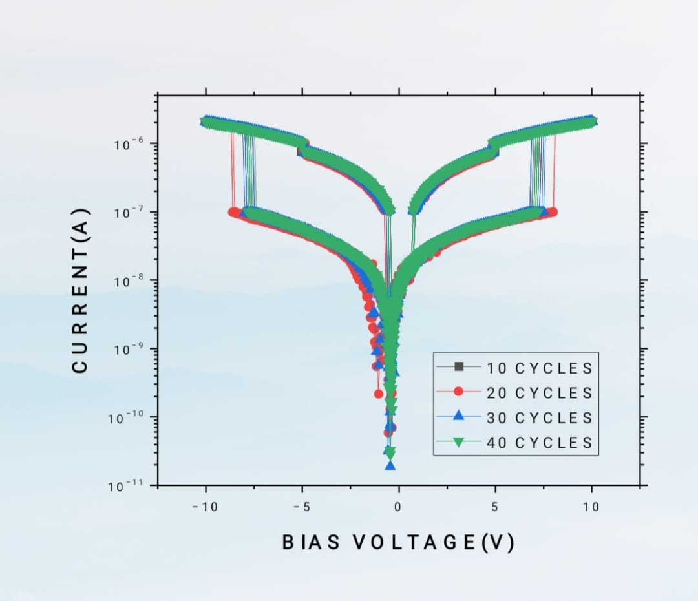

# Fabrication and Testing of WO3 and V2O5 Based Memristors

This project involves the fabrication and testing of memristors based on WO3 and V2O5 thin films. The process integrates advanced deposition techniques and thorough characterization to achieve high-quality memristors.

## Project Overview

- **Thin Film Fabrication**: Developed and optimized the fabrication process for tungsten trioxide (WO3) and vanadium pentoxide (V2O5) thin films on a SiO2/silicon substrate, achieving high-quality and uniform thin films.
- **Memristor Integration**: Integrated memristor technology by precisely controlling deposition parameters such as temperature, pressure, and time, ensuring consistent material quality.
- **Advanced Deposition Techniques**: Employed DC sputtering for tungsten and vanadium deposition, followed by Chemical Vapor Deposition (CVD) at 600°C and 550°C for the formation of WO3 and V2O5, respectively.
- **Characterization and Testing**: Conducted thorough electrical and optical characterization to validate the integrity and performance of the fabricated thin films.
- **Team Collaboration**: Contributed to various stages of the project, including substrate preparation, deposition processes, and result analysis, leading to successful project outcomes.

## Flowchart of the Fabrication Process

## Characterization Results

### 1. Resistance vs Time

### 2. Voltage vs Current

### 3. Voltage vs Current with Cycles

## Conclusion

The project successfully demonstrated the fabrication of WO3 and V2O5 based memristors with precise control over thin film deposition and high-quality results validated through extensive characterization.
